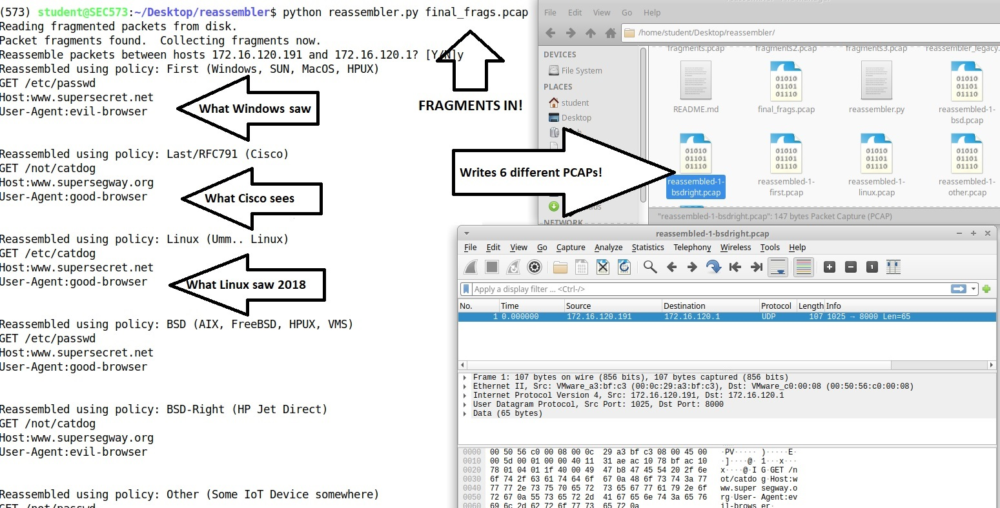

# reassembler
## A Python implementation of the various OS IPv4 packet fragment reassembly engines.

### One Packet in => Six Packets out

This module will reassemble fragmented packets using common used fragmentation reassembly techniques.  It then generates 6 pcap files. It also prints the payloads to the screen and shows you how each of the operating systems would see the packets after they reassemble them using their defragmentation engine.

This is a rewrite of the original released in 2012 to support Python3.
[Associated GIAC SANS Gold Paper](https://www.sans.org/reading-room/whitepapers/tools/ip-fragment-reassembly-scapy-33969)

---

### Still an issue?

10-16-2020: [Don Williams](https://twitter.com/bashwrapper) and I did a survey of the major OSes to confirm the status of their reassembly engines. Here are the results:

 - [Linux](https://git.kernel.org/pub/scm/linux/kernel/git/torvalds/linux.git/commit/?id=c30f1fc041b74ecdb072dd44f858750414b8b19f) 
: The Linux OS's have begun silently ignoring overlapping IPv4 fragments. IPv6 rejects them by defalt.

 - [Windows](https://portal.msrc.microsoft.com/en-us/security-guidance/advisory/ADV180022): The posted "Fix" requires that you turn off ALL fragment reassembly, not just overlaps. It is not enabled by default.

 - Macintosh: Tested on 10-16-2020 and it was still reassembling overlapping fragments without complaint.

---

